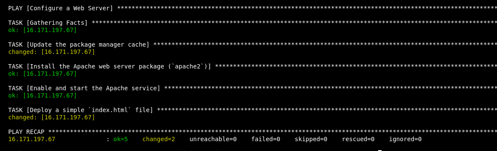

# Automating Apache Web Server Setup with Ansible

## Steps to Automate Apache Web Server Setup

### 1. Update the Package Manager Cache
Ensure the package manager cache is up-to-date to install the latest software versions.

### 2. Install Apache Web Server
Use the `apt` module to install the Apache web server (`apache2`) package.

### 3. Enable and Start Apache Service
Enable the Apache service to start on boot and ensure it is running.

### 4. Deploy a Custom `index.html`
Deploy a simple `index.html` file to `/var/www/html/` with the message: `Hello, Ansible!`

## Required Files

1. Playbook: 'web_server_setup.yml'
2. Inventory File: 'inventory.ini'
3.Ansible configration File: 'ansible.cfg'
## Usage Instructions
1. Save the playbook as 'web_server_setup.yml'.
2. Create an inventory file 'inventory' with details of your remote server and configration file 'ansible.cfg' .
3. Run the playbook:
   ```bash
   ansible-playbook -i inventory web_server_setup.yml
   ```
   

4. Verify the setup:
   - Check the Apache service:
     ```bash
     systemctl status apache2
     ```
    
   - Visit the server's IP in a web browser to confirm the `Hello, Ansible!` page is displayed.
    

## Notes
- Ensure the SSH user has sufficient privileges (passwordless sudo access).
- Test the playbook on a staging environment before deploying to production.

## Outcome
This playbook automates:
- Updating the package manager cache.
- Installing and configuring Apache.
- Deploying a custom webpage.


Simplify your web server setup with Ansible!
